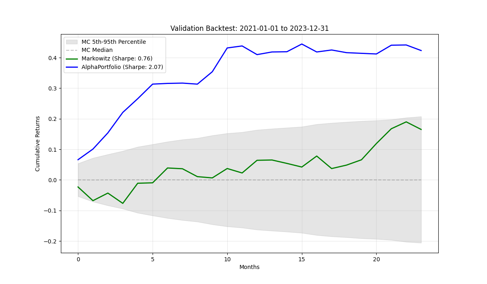

# Transformer-Based Long/Short Portfolio Allocation

A deep learning system allocating top winner and loser assets to formulate a dynamic long-short portfolio. Uses a multi-sequence of neural networks comprising SREM, CAAN, and a portfolio generator.

## Features

- **SREM**: Transformer-based sequential feature extraction from multi-asset time series
- **CAAN**: Cross-asset attention mechanism to capture inter-asset relationships
- **Long-Short Portfolio**: Top-G and bottom-G asset selection with softmax weighting
- **Sharpe Optimization**: Direct maximization of risk-adjusted returns via differentiable loss
- **Robustness Testing**: Testing: 100,000 Monte Carlo simulations for statistical validation

## Model Performance

| Metric            | This Model | Markowitz Baseline |
| :---------------- | :--------: | :----------------: |
| Annualized Sharpe |  **2.07**  |        0.76        |
| Maximum Drawdown  |  **3.3%**  |        5.4%        |
| Final Return      | **42.3%**  |       16.5%        |
| MC Percentile     | **99.95%** |       90.33%       |

The model outperforms random long-short portfolios in 99.95% of Monte Carlo simulations, demonstrating strong statistical robustness.



## Project Structure

```
🧠 RL-portfolio-optimizer/
├── configs/
│   └── 📄 config.yaml     # Configuration and hyperparameters
│
├── data/
│   └── 📊 data.py         # PortfolioData dataset class and data
│
├── model/
│   └── 🏗️ model.py        # Portfolio model and SharpeLoss
│
├── train/
│   └── 🏋️ train.py        # Training and validation loop
│
├── 📋 evaluate.py         # Backtesting, Markowitz baseline, MC
├── 💾 saved_models/       # Model checkpoints
├── 🚀 main.py             # Main entry point
├── 📦 requirements.txt    # Python dependencies
└── 📖 README.md           # This file
```

## Installation

This project was developed and tested with **Python 3.11.9**.

```bash
pip install -r requirements.txt
```

## Usage

### Training

Train the model:

```bash
python main.py
```

### Evaluation

Benchmark the model against a Rolling Markowitz baseline and test for robustness:

```bash
python evaluate.py
```
